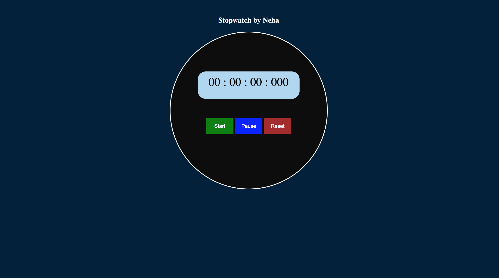

# Smartwatch App

Hello there my self Neha pandey.This is my second JavaScript project.
The notable point of this stopwatch is that here you can count the hours, minutes, seconds, and milliseconds.

## Challenges 

I have completed this project (Simple Stopwatch using JavaScript) in three steps. First I made the display then I added the buttons and at the end of all, I made the stopwatch functional.
- Created the basic structure of the stopwatch
- Created a screen to see the time
- Created 3 buttons in Stopwatch using HTML CSS
- Activated Simple Stopwatch using JavaScript

## Total time to complete this project

It took me around 3 hrs to complete this project